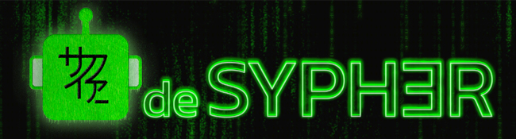

# deSypher Telegram Bot

The deSypher Telegram Bot is part of the deSypher project, providing an interactive experience for users directly within Telegram. This bot can handle various commands and interact with users to enhance their engagement with the deSypher platform.

## Features

- **/start**: Initialize interaction with the bot.
- **/help**: Get a list of available commands and usage instructions.
- **/play**: Start a new game or interaction.
- **/tukyo**: Access special features or hidden content.
- **/tukyogames**: Get information about ongoing or upcoming games.
- **/about**: Learn more about the deSypher project.
- **/desypher**: Get details about the deSypher mechanism.
- **/sypher**: Understand how syphers work within the game.